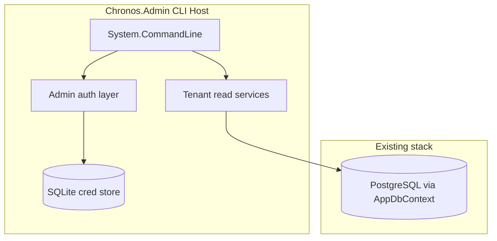

# Chronos.Admin — Platform Administration CLI

## Status

**Phase 1 (current):** Project scaffold only. The CLI builds and prints a placeholder message. No authentication, SQLite, or tenant queries are implemented.

See [Implementation phases](#implementation-phases) at the end of this document.

---

## Purpose

`Chronos.Admin` is an **internal operations tool** for platform administrators. It is intentionally **separate from customer-facing auth** (`Chronos.MainApi`):

| Concern | MainApi | Chronos.Admin |
|--------|---------|---------------|
| Identity | Org-scoped `User` records | Platform admin accounts only |
| Auth store | PostgreSQL | SQLite credential file |
| Auth mechanism | JWT + `x-org-id` tenant header | Admin JWT/session (CLI-local) |
| Data access | Per-organization APIs | Cross-tenant **read-only** views |

Operators use it to inspect all organizations (tenants) in the system: name, administrator email(s), and user counts.

---

## Threat model

- **Audience:** Trusted internal staff only (DevOps, support leads).
- **Exposure:** CLI runs on operator machines or secured jump hosts. No public internet exposure in the initial design.
- **Credentials:** Default bootstrap admin comes from environment/secrets only—never from source control.
- **SQLite file:** Contains password hashes. Must not be committed (see `.gitignore` entries for `admin-creds.db`).
- **PostgreSQL:** Read-only cross-tenant queries; no destructive org operations in v1.
- **Future HTTP API:** If added, bind to internal network/VPN and reuse the same auth layer.

---

## Architecture



### Project layout (target)

```
src/Chronos.Admin/
├── Program.cs                 # CLI entry + host bootstrap
├── ModuleDiExtension.cs       # DI registration
├── docs/                      # Design and architecture documentation
├── Configuration/
│   └── AdminConfiguration.cs
├── Auth/                      # Admin identity, login, account management
├── Organizations/             # Cross-tenant org listing
├── CredStore/                 # AdminCredDbContext, migrations (planned)
└── AppSettings/
```

Application services should be **host-agnostic** (no HTTP types in core logic) so an optional REST API can be added later without duplicating business rules.

### Tenant data access

`Chronos.Data` applies EF global query filters when `x-org-id` is present on the HTTP context. The admin host registers `IHttpContextAccessor` with a **null** context (same pattern as `Chronos.Offboarding`), which bypasses tenant filters.

For explicit cross-tenant reads, services will use `IgnoreQueryFilters()` where appropriate.

**Planned repository additions** (in `Chronos.Data` or thin admin services):

| Operation | Approach |
|-----------|----------|
| List active organizations | `Organization` query with `IgnoreQueryFilters()`, `Deleted == false` |
| Admin emails per org | `RoleAssignment` where `Role == Administrator`, join `User.Email` |
| User count per org | `User` count grouped by `OrganizationId` |

Reference entities: `Organization`, `User`, `RoleAssignment`, `Role.Administrator` in `Chronos.Domain`.

---

## CLI design

Built with **System.CommandLine**. The executable is `Chronos.Admin` (or `dotnet run --project src/Chronos.Admin`).

### Command tree (planned)

```
chronos-admin
├── login [--email] [--password]
├── accounts
│   ├── add <email> [--password]
│   └── list
└── orgs
    ├── list [--json] [--include-deleted]
    └── show <organization-id> [--json]
```

### Sample invocations

```bash
# Bootstrap / first login (uses env default if no accounts exist)
dotnet run --project src/Chronos.Admin -- login --email admin@internal.example

# List all tenants (table output)
dotnet run --project src/Chronos.Admin -- orgs list

# Machine-readable output
dotnet run --project src/Chronos.Admin -- orgs list --json

# Single organization detail
dotnet run --project src/Chronos.Admin -- orgs show 3fa85f64-5717-4562-b3fc-2c963f66afa6
```

### Exit codes

| Code | Meaning |
|------|---------|
| 0 | Success |
| 1 | General error |
| 2 | Authentication required or session expired |
| 3 | Invalid arguments |
| 4 | Resource not found (e.g. unknown org id) |

### Output formats

- **Default:** Fixed-width table to stdout (human-friendly).
- **`--json`:** JSON array/object to stdout for scripting.

Example `OrgSummary` (list row):

```json
{
  "organizationId": "3fa85f64-5717-4562-b3fc-2c963f66afa6",
  "name": "Acme Scheduling",
  "adminEmails": ["admin@acme.example"],
  "userCount": 42,
  "createdAt": "2025-01-15T10:30:00Z"
}
```

---

## Authentication lifecycle

### Bootstrap default admin

On first run, if the SQLite cred store has no accounts:

1. Read `AdminConfiguration:DefaultEmail` and `AdminConfiguration:DefaultPassword` from configuration/environment.
2. If either is missing, fail with a clear message directing the operator to set env vars.
3. Create the first `AdminAccount` with `IsBootstrap = true` and a BCrypt password hash.

Environment variable examples:

```text
AdminConfiguration__DefaultEmail=admin@internal.example
AdminConfiguration__DefaultPassword=<strong-secret>
AdminConfiguration__SecretKey=<jwt-signing-key-min-32-chars>
AdminConfiguration__CredStorePath=./data/admin-creds.db
```

### Additional accounts

`accounts add` creates further platform admins in SQLite. Bootstrap account cannot be deleted via CLI without a separate maintenance path (documented for ops).

### Login and session

1. `login` validates email/password against SQLite (BCrypt verify).
2. On success, issue a signed JWT (or HMAC token) using `AdminConfiguration:SecretKey`.
3. Store token in a local session file (e.g. `%USERPROFILE%\.chronos-admin\session` on Windows, `~/.chronos-admin/session` on Linux) with restrictive file permissions.
4. Subsequent commands read the session file; expired tokens return exit code 2.

**Note:** Admin JWT must use **different** issuer/audience/secret from `AuthConfiguration` in MainApi to prevent token confusion.

### Password storage

- Algorithm: BCrypt (package `BCrypt.Net-Next`, same as MainApi).
- Never log passwords or raw tokens.

---

## SQLite credential store

Isolated from PostgreSQL migrations in `Chronos.Data`.

### DbContext

`AdminCredDbContext` lives in `Chronos.Admin` only (planned folder: `CredStore/`).

### Schema sketch

**Table: `AdminAccounts`**

| Column | Type | Notes |
|--------|------|-------|
| `Id` | GUID | Primary key |
| `Email` | string | Unique, normalized lowercase |
| `PasswordHash` | string | BCrypt |
| `IsBootstrap` | bool | First seeded account |
| `CreatedAt` | DateTimeOffset | UTC |

### Connection

Prefer file path via `AdminConfiguration:CredStorePath` (default `./data/admin-creds.db`).

Optional override: `AdminConfiguration:CredStoreConnection` with full SQLite connection string.

EF Core package: `Microsoft.EntityFrameworkCore.Sqlite` on **Chronos.Admin only**.

Migrations: `dotnet ef migrations add ... --project src/Chronos.Admin` (separate from PostgreSQL migrations).

---

## PostgreSQL configuration

The admin CLI reads tenant data through existing `Chronos.Data` (`AppDbContext`).

```text
ConnectionStrings__DefaultConnection=Host=localhost;Database=chronos;...
```

Registration (planned in `AddAdminModule`):

```csharp
services.AddDbContext<AppDbContext>(options =>
    options.UseNpgsql(connectionString));
services.AddServiceRepositories(); // or targeted repository registration
```

No `AppDbContext` registration exists in the scaffold to avoid requiring Postgres at startup.

---

## Configuration reference

| Setting | Env var | Description |
|---------|---------|-------------|
| `ConnectionStrings:DefaultConnection` | `ConnectionStrings__DefaultConnection` | PostgreSQL for tenant data |
| `AdminConfiguration:CredStorePath` | `AdminConfiguration__CredStorePath` | SQLite file path |
| `AdminConfiguration:DefaultEmail` | `AdminConfiguration__DefaultEmail` | Bootstrap admin email |
| `AdminConfiguration:DefaultPassword` | `AdminConfiguration__DefaultPassword` | Bootstrap admin password |
| `AdminConfiguration:SecretKey` | `AdminConfiguration__SecretKey` | Token signing key |
| `AdminConfiguration:TokenExpiryMinutes` | `AdminConfiguration__TokenExpiryMinutes` | Session lifetime (default 480) |

Files:

- `AppSettings/appsettings.json`
- `AppSettings/appsettings.{Environment}.json` (optional)
- Environment variables override JSON (ASP.NET Core `__` convention)

`.env.example` will be extended in a later implementation PR.

---

## Future optional HTTP API

Not in scope for the CLI-first phase. When added:

- Separate Kestrel host or `serve` subcommand wrapping the same services.
- Endpoints mirror CLI capabilities (`GET /orgs`, `POST /auth/login`, etc.).
- Same SQLite auth and PostgreSQL read path.

---

## Operational notes

### Local development

```bash
cd Chronos.Service
dotnet build
dotnet run --project src/Chronos.Admin -- --help
```

Ensure PostgreSQL is running before using org commands (once implemented).

### File permissions

- Restrict access to `admin-creds.db` and the session file to the operator OS user.
- Create `./data/` if missing before first bootstrap.

### Docker / CI

Planned for Phase 4: Dockerfile, `docker-compose` service, publish workflow entry. Not included in the scaffold.

---

## Implementation phases

| Phase | Scope | Status |
|-------|--------|--------|
| **1** | Empty project, CLI stub, this design doc | **Done (scaffold)** |
| **2** | SQLite `AdminCredDbContext`, bootstrap seed, `login`, `accounts add/list` | Planned |
| **3** | `orgs list` / `orgs show` via `Chronos.Data` cross-tenant reads | Planned |
| **4** | Docker, CI publish, `.env.example`, tests (`Chronos.Tests.Admin`) | Planned |
| **5** | Optional HTTP API | Future |

---

## Related documentation

- [README.md](../README.md) — overview and quick start
- Main API auth (customer): `src/Chronos.MainApi/Auth/`
- Offboarding cross-tenant pattern: `src/Chronos.Offboarding/Program.cs`
